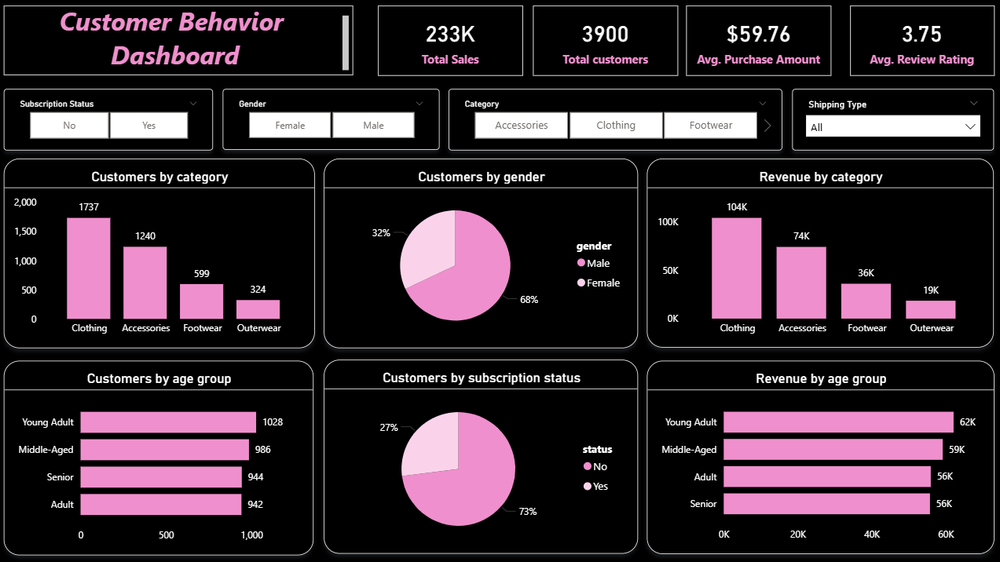

# Customer Shopping Behavior Analysis

## Overview

Analyzing customer shopping behavior to uncover purchasing patterns and business insights, I use Python for data cleaning and feature engineering, SQL to extract transactional trends, and Power BI to build interactive dashboards. This approach reveals how factors such as gender, age, subscription status, discounts, and product categories shape customer purchasing behavior.
## Final Dashboard



The `dashboard.pbix` file provides an interactive Power BI dashboard with key insights.

**Key Metrics**:
- Total Sales: $233K
- Total Customers: 3,900
- Avg. Purchase Amount: $59.76
- Avg. Review Rating: 3.75

**Visuals**:
- Revenue and customer count by category, gender, age group, and subscription status
- Filters for category, gender, shipping type, and subscription
- Customer segmentation and loyalty trends

## Repository Contents

- `dataset.csv`: Raw customer transaction data
- `customer_behavior_project.ipynb`: Jupyter Notebook for data cleaning and preprocessing
- `sql_analysis.sql`: SQL queries answering 10 business questions
- `dashboard.pbix`: Power BI dashboard file
- `Images/customer_behavior_dashboard.png`: Screenshot of the Power BI dashboard

## Technologies Used

- Python: Pandas, SQLAlchemy, Jupyter Notebook
- SQL: PostgreSQL
- Visualization: Power BI
- Database: PostgreSQL

## Data Preparation

The data is preprocessed in `customer_behavior_project.ipynb` using Python (Pandas). Below are the key steps, each shown as a separate code snippet.

### Load Dataset
```python
import pandas as pd

# Load dataset
df = pd.read_csv("dataset.csv")
```

### Impute Missing Review Ratings
```python
# Impute missing Review Ratings with category-wise median
df['Review Rating'] = df.groupby('Category')['Review Rating'].transform(lambda x: x.fillna(x.median()))
```

### Rename Columns to Snake Case
```python
# Rename columns to snake case
df.columns = df.columns.str.lower().str.replace(' ', '_')
df.rename(columns={'purchase_amount_(usd)': 'purchase_amount'}, inplace=True)
```

### Feature Engineering: Age Groups
```python
# Feature engineering: Age groups
labels = ['Young Adult', 'Adult', 'Middle-Aged', 'Senior']
df['age_group'] = pd.qcut(df['age'], q=4, labels=labels)
```

### Feature Engineering: Purchase Frequency
```python
# Feature engineering: Purchase frequency in days
frequency_mapping = {
    'Fortnightly': 14, 'Weekly': 7, 'Monthly': 30,
    'Quarterly': 90, 'Bi-Weekly': 14, 'Annually': 365,
    'Every 3 Months': 90
}
df['purchase_frequency_days'] = df['frequency_of_purchases'].map(frequency_mapping)
```

### Drop Redundant Column
```python
# Drop redundant column
assert (df['discount_applied'] == df['promo_code_used']).all()
df.drop(columns=['promo_code_used'], inplace=True)
```

### Load Data to PostgreSQL
```python
from sqlalchemy import create_engine

# Connect to PostgreSQL and load data
username = "postgres"
password = "*******"
host = "localhost"
port = "5432"
database = "customer_behavior"
engine = create_engine(f"postgresql+psycopg2://{username}:{password}@{host}:{port}/{database}")
df.to_sql("customer", engine, if_exists="replace", index=False)
```

## SQL Analysis

The `sql_analysis.sql` file contains PostgreSQL queries answering 10 business questions. Each query is presented below as a separate snippet.

### Q1: What is the total revenue generated by male vs. female customers?
```sql
SELECT gender, SUM(purchase_amount) AS revenue
FROM customer
GROUP BY gender;
```

### Q2: Which customers used a discount but still spent more than the average purchase amount?
```sql
SELECT customer_id, purchase_amount
FROM customer
WHERE discount_applied = 'Yes' AND purchase_amount > (SELECT AVG(purchase_amount) FROM customer);
```

### Q3: Which are the top 5 products with the highest average review rating?
```sql
SELECT item_purchased, ROUND(AVG(review_rating::numeric), 2) AS avg_rating
FROM customer
GROUP BY item_purchased
ORDER BY avg_rating DESC
LIMIT 5;
```

### Q4: Compare the average Purchase Amounts between Standard and Express Shipping.
```sql
SELECT shipping_type, ROUND(AVG(purchase_amount::numeric), 2)
FROM customer
WHERE shipping_type IN ('Standard', 'Express')
GROUP BY shipping_type;
```

### Q5: Do subscribed customers spend more? Compare average spend and total revenue between subscribers and non-subscribers.
```sql
SELECT subscription_status, COUNT(customer_id) AS num_of_customers, 
       ROUND(AVG(purchase_amount::numeric), 2) AS avg_purchase_amount, 
       SUM(purchase_amount) AS total_revenue
FROM customer
GROUP BY subscription_status;
```

### Q6: Which 5 products have the highest percentage of purchases with discounts applied?
```sql
SELECT item_purchased, 
       ROUND(SUM(CASE WHEN discount_applied = 'Yes' THEN 1 ELSE 0 END) * 100.0 / COUNT(*), 2) AS discount_percentage
FROM customer
GROUP BY item_purchased
ORDER BY discount_percentage DESC
LIMIT 5;
```

### Q7: Segment customers into New, Returning, and Loyal based on their total number of previous purchases, and show the count of each segment.
```sql
WITH customer_type AS (
    SELECT customer_id, previous_purchases, 
           CASE 
               WHEN previous_purchases = 1 THEN 'New'
               WHEN previous_purchases BETWEEN 1 AND 10 THEN 'Returning'
               ELSE 'Loyal'
           END AS customer_segment
    FROM customer
)
SELECT customer_segment, COUNT(*)
FROM customer_type
GROUP BY customer_segment;
```

### Q8: What are the top 3 most purchased products within each category?
```sql
WITH category_items_ranked AS (
    SELECT category, item_purchased, COUNT(*) AS count, 
           RANK() OVER(PARTITION BY category ORDER BY COUNT(*) DESC) AS rn
    FROM customer
    GROUP BY category, item_purchased
)
SELECT category, item_purchased, count
FROM category_items_ranked
WHERE rn <= 3;
```

### Q9: Are customers who are repeat buyers (more than 5 previous purchases) also likely to subscribe?
```sql
SELECT subscription_status, COUNT(customer_id)
FROM customer
WHERE previous_purchases > 5
GROUP BY subscription_status;
```

### Q10: What is the revenue contribution of each age group?
```sql
SELECT age_group, SUM(purchase_amount)
FROM customer
GROUP BY age_group;
```

## How to Run the Project

1. **Clone the Repository**:
   ```bash
   git clone https://github.com/AkillerKavinda/Customer-Shopping-Behavior-Analysis-Project.git
   ```

2. **Install Dependencies**:
   ```bash
   pip install pandas sqlalchemy psycopg2-binary
   ```

3. **Set Up PostgreSQL**:
   - Install PostgreSQL and create a database named `customer_behavior`.
   - Update connection details (username, password, host, port) in `customer_behavior_project.ipynb`.

4. **Run the Notebook**:
   - Open `customer_behavior_project.ipynb` in Jupyter Notebook.
   - Execute the cells to preprocess data and load it into PostgreSQL.

5. **Execute SQL Queries**:
   - Use a PostgreSQL client (e.g., pgAdmin, psql) to run queries in `sql_analysis.sql`.

6. **Explore the Dashboard**:
   - Open `dashboard.pbix` in Power BI Desktop to interact with the visualizations.

## Requirements

- Python: 3.x (with pandas, sqlalchemy, psycopg2-binary)
- PostgreSQL: For database operations
- Power BI Desktop: For dashboard visualization
- Jupyter Notebook: For running the Python notebook

## About the Creator

- Created by **Akila Kavinda Herath**
- Built as part of a hands-on journey into **Python, SQL, and Power BI** for data analytics and visualization
- Inspired by [this excellent project by Amlan Mohanty](https://github.com/amlanmohanty1/customer-trends-data-analysis-SQL-Python-PowerBI)
- Connect with me on [LinkedIn](https://www.linkedin.com/in/akila-kavinda-herath)!
